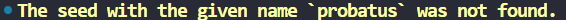
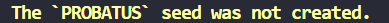

# Tutorial

## Instalando a biblioteca em seu projeto



## Seeds pré-preparadas

Assim que fizer `migrate`, será criado 3 seeds nos modelos da biblioteca
`Account` e `Card`. Para pegar estes dados utilize o método `get_seeds` da
classe `PaymentSDK`, cada dado representado por uma chave fará uma um tipo de
transação, estas chaves são: 

- `PROBATUS`: `{transaction: success, ...}`.
- `REPROBI`: `{transaction: failure, ...}`.
- `PENDENTE`: `{transaction: pending, ...}`.

Veja um exemplo de como obter esses dados.



## Manipulando seeds utilizando o CLI

Uma forma simples de lidar com as seeds é através do uso da interface de linha de comando (CLI).
Veja abaixo as formas de se lidar com estas manipulações.

### Apagar seeds

Caso queira apagar as seeds existentes use o seguinte comando:

```{.bash}
python manage.py deleteseeds
```


Também é possível apagar seeds específicas utilizando a flag `-n` ou `--name`:

```{.bash}
python manage.py deleteseeds --name probatus
```


Caso o nome informado da seed não for encontrado ocasionará a seguinte resposta:



!!! Info
    Quando for apagar uma seeds especifica, o nome que for passado pode ser com letras maiusculas ou minusculas,
    contanto que o nome esteja correto irá funcionar.

### Criar seeds

Para criar as seeds use o seguinte comando:

```{.bash}
python manage.py createseeds
```


!!! Info
    Ao criar as seeds, se já existir alguma criada, só será criada as seeds que estão faltando.

### Definir saldo

A única seed que pode ser definida um novo saldo é a seed `PROBATUS`.
Quando uma transação é feita usando-a, o `amount` é deduzido do `balance`,
e consequentemente, o valor do saldo diminuirá. Para definir um novo valor (valor padrão: 99999),
use o seguinte comando:

```{.bash}
python manage.py setbalance
```


Também é possível definir um valor desejado usando a flag `-b` ou `--balance`:

```{.bash}
python manage.py setbalance --balance 10000
```


Caso a seed `PROBATUS` não exista ocasionará a seguinte resposta:



## Resultado das transações
- `success`: se todas as credenciais estiverem corretas e o valor total da compra
for menor que o valor do `balance`.
- `failure`: se uma ou mais credenciais estiver errada ou se o valor da compra
for maior que o valor do `balance`.
- `pending`: se o valor do `card_flag` for definido como `OTHER`.


## Como realizar uma transação

Escolha uma seed de acordo com a transação desejada, pegue os seguintes dados:
`cpf`, `card_number`, `validity`, `cvv` e `card_holder_name`. Depois utilize-os
no método `payment()` da classe `PaymentSDK`, mas antes de utilizar o método é
preciso passar uma lista com um ou mais dicionários, cada um contendo os
dados do produto, em cada dicionário é obrigatório ter as chaves `quantity`
e `unit_price`, também é possível (e recomendado) adicionar outras chaves de
sua preferência contendo informações do produto.

- `quantity`: um valor `int` que indicará a quantia do produto.
- `unit_price`: um `float` que indicará o preço do produto.
- `payment()`: recebe as credenciais do cartão (modelo `Card`) e retornará uma
resposta `JSON` contendo o resultado da transação e os dados relacionados a
lista de produtos que foram passados no inicializador da classe. Se a transação
for um `transaction: success`, o valor obtido da `quantity` vezes o
`unit_price` será descontado do `balance` da conta (modelo `Account`)
 vinculada ao cartão.

Veja um exemplo de como realizar uma transação.  



## Como criar uma nova conta e cartão
Durante a criação de uma conta e de um cartão, não será necessário passar todos os
parâmetros, pois alguns receberão valores `default`. No modelo
`Account` os parâmetros necessários será `cpf`, `account_holder_name` e `balance`.
Já os do modelo `Card` serão `account`, `card_holder_name`, `card_flag`, e o `pin`.

- **Parâmetros do modelo `Account`**
    - `cpf`: recebe uma `str` (apenas dígitos) de um cpf válido.
    - `account_holder_name`: recebe uma `str` (apenas letras e espaços).
    - `account_number`: receberá um valor `default` ou então poderá receber uma 
    `str` (apenas dígitos) de até no máximo 20 dígitos.
    - `balance`: recebe um `int` ou uma `str` de um número inteiro ou um
    número de ponto flutuante de até duas casas decimais.
    - `status`: receberá uma choice `('AC', 'active')` como valor `default`,
    as outras choices que poderão ser passadas são `('IN', 'inactive')` e `('BL', 'blocked')`.

- **Parâmetros do modelo `Card`**
    - `account`: recebe uma instância do modelo `Account`.
    - `card_holder_name`: recebe uma `str` (apenas letras e espaços).
    - `card_number`: receberá um valor `default` ou então poderá receber uma 
    `str` (apenas dígitos) de até no máximo 16 dígitos.
    - `validity`: receberá um valor `default` ou então poderá receber um `date`.
    - `cvv`: receberá um valor `default` ou então poderá receber um `str`. 
    (apenas dígitos) de até no máximo 4 dígitos.
    - `card_flag`: recebe uma choice, as choices que poderá ser passadas são
    `VISA` (Visa), `MC` (MasterCard), `ELO` (Elo) e `OTHER` (Other). 
    - `active`: recebe um valor `bool`, `True` como valor `default`.
    - `pin`: recebe uma `str` (apenas dígitos).


